# データベース設計書

## 1. 設計方針
### 1.1 命名規則
- 実装原本は [databese.dbml](/Users/ogihaya/Documents/プログラミング/資産管理アプリ/docs/requirements/public/databese.dbml) とし、レビュー補助として [databese_ja.dbml](/Users/ogihaya/Documents/プログラミング/資産管理アプリ/docs/requirements/public/databese_ja.dbml) を併記する。
- テーブル名・カラム名は英語の `snake_case` を採用する。
- 主キーは整数連番 `id`、外部キーは `<parent>_id` を採用する。
- 月単位の有効日や対象月は `*_month` で統一し、月初日の `date` で保持する。
- 金額はすべて円単位 `bigint` で保持する。

### 1.2 共通カラム
| 項目 | 対象 | 方針 |
|---|---|---|
| `id` | 全テーブル | 整数連番の主キー |
| `created_at` | マスタ・履歴・認証・月次記録 | 作成日時を `timestamptz` で保持 |
| `updated_at` | 更新主体のあるテーブル | 更新日時を `timestamptz` で保持 |
| `deleted_at` | `users` のみ | 論理削除日時として保持 |

### 1.3 月次レコード生成方針
- 新規ユーザー作成時に、アプリケーション側で `monthly_records` を当月分と次月分の2件用意する。
- 月次確定時は、確定対象月の次月が未作成であれば自動生成する。
- DBトリガーや定期バッチではなく、アプリケーション処理で生成する。

### 1.4 インデックス方針
- ログインや再設定に使う識別子は一意制約を付与する。
  - `users.email`
  - `user_sessions.session_token_hash`
  - `password_reset_tokens.token_hash`
- 月次・履歴・設定改定は「親ID + 月」を基本一意単位とする。
  - 例: `monthly_records(user_id, record_month)`
  - 例: `asset_name_revisions(asset_id, effective_month)`
- 月次値テーブルは「月次記録 + 定義ID」を一意単位とする。
- 期間重複禁止、同月時点での名称重複禁止、配分比率合計100.00%などの複雑制約はDBではなくアプリケーションで保証する。

### 1.5 論理削除 vs 物理削除
- `users` は論理削除とし、`deleted_at` を保持する。
- 資産・収入・投資先は物理削除せず、有効期間テーブルで削除/復活を表現する。
- 月次記録、月次値、ライフプラン、設定改定は履歴として保持し、物理削除を前提にしない。
- 論理削除したユーザーのメールアドレスは再利用不可とする。

### 1.6 FK削除方針
- 外部キー削除方針は基本 `RESTRICT` とし、参照中の業務データは物理削除しない。
- 認証系トークン・セッションも、通常運用では失効/使用済みで管理し、物理削除は保守目的に限定する。
- 資産・収入・投資先の削除/復活は、有効期間行の追加・更新で表現する。

### 1.7 保存・再計算方針
- 投資可能額、採用イベント、配分結果などの投資計算結果はDBへ保存せず、確定済み月次入力値から毎回再計算する。
- 月次未入力は `NULL` ではなく「値行が存在しない」ことで表現する。
- `monthly_records.expense_final_yen` には、支出推定/補正後に採用された最終確定値のみを保存する。
- `monthly_records` は月次確定時にアプリケーション側で次月分を自動生成する前提とする。
- 生活防衛資金と投資先配分は、同じ有効開始月を持つ `settings_revisions` と `settings_revision_target_allocations` の組で1つの設定改定として扱う。

### 1.8 表示順・重複・金額制約方針
- 資産・収入・投資先の表示順は `created_at` 順を基準にする。
- 名称重複禁止は同一ユーザー内を対象とする。
- 負値を許容する金額は通常資産評価額のみとする。
- 収入実績、投資評価額、生活防衛資金、ライフプラン金額は 0 以上とする。
- 有効期間テーブルは同一定義内で非重複とし、復活時は新しい期間行を追加する。

## 2. ER図

```mermaid
erDiagram
    users ||--o{ user_sessions : has
    users ||--o{ password_reset_tokens : has
    users ||--o{ asset_definitions : owns
    users ||--o{ income_definitions : owns
    users ||--o{ investment_target_definitions : owns
    users ||--o{ settings_revisions : owns
    users ||--o{ monthly_records : records
    users ||--o{ life_plan_events : plans

    asset_definitions ||--o{ asset_name_revisions : renamed_by
    asset_definitions ||--o{ asset_visibility_periods : visible_by
    asset_definitions ||--o{ monthly_asset_values : valued_in

    income_definitions ||--o{ income_name_revisions : renamed_by
    income_definitions ||--o{ income_visibility_periods : visible_by
    income_definitions ||--o{ monthly_income_values : recorded_in

    investment_target_definitions ||--o{ investment_target_name_revisions : renamed_by
    investment_target_definitions ||--o{ investment_target_visibility_periods : visible_by
    investment_target_definitions ||--o{ settings_revision_target_allocations : allocated_in
    investment_target_definitions ||--o{ monthly_investment_valuations : valued_in

    settings_revisions ||--o{ settings_revision_target_allocations : contains

    monthly_records ||--o{ monthly_asset_values : contains
    monthly_records ||--o{ monthly_income_values : contains
    monthly_records ||--o{ monthly_investment_valuations : contains
```

## 3. テーブル定義
### 3.1 認証・ユーザー管理
| テーブル | 主なカラム | 説明 |
|---|---|---|
| `users` | `email`, `password_hash`, `deleted_at` | ユーザー本体。メール+パスワード認証と論理削除を管理する。 |
| `user_sessions` | `user_id`, `session_token_hash`, `expires_at`, `revoked_at` | ログイン中セッションを管理する。複数端末ログインと30日有効期限に対応する。 |
| `password_reset_tokens` | `user_id`, `token_hash`, `expires_at`, `used_at` | パスワード再設定トークンを管理する。 |

#### users
| カラム名 | 型 | NULL | デフォルト | 説明 |
|---|---|---|---|---|
| `id` | int | 否 | increment | ユーザーID |
| `email` | varchar(255) | 否 | - | ログイン用メールアドレス。全体で一意 |
| `password_hash` | varchar(255) | 否 | - | パスワードハッシュ |
| `name` | varchar(255) | 可 | - | 表示名 |
| `deleted_at` | timestamptz | 可 | - | 論理削除日時 |
| `created_at` | timestamptz | 否 | `now()` | 作成日時 |
| `updated_at` | timestamptz | 否 | `now()` | 更新日時 |

#### user_sessions
| カラム名 | 型 | NULL | デフォルト | 説明 |
|---|---|---|---|---|
| `id` | int | 否 | increment | セッションID |
| `user_id` | int | 否 | - | 対象ユーザー |
| `session_token_hash` | varchar(255) | 否 | - | セッショントークンのハッシュ |
| `expires_at` | timestamptz | 否 | - | 有効期限 |
| `revoked_at` | timestamptz | 可 | - | 明示失効日時 |
| `last_seen_at` | timestamptz | 可 | - | 最終アクセス日時 |
| `created_at` | timestamptz | 否 | `now()` | 作成日時 |

#### password_reset_tokens
| カラム名 | 型 | NULL | デフォルト | 説明 |
|---|---|---|---|---|
| `id` | int | 否 | increment | 再設定トークンID |
| `user_id` | int | 否 | - | 対象ユーザー |
| `token_hash` | varchar(255) | 否 | - | 再設定トークンのハッシュ |
| `expires_at` | timestamptz | 否 | - | 有効期限 |
| `used_at` | timestamptz | 可 | - | 使用日時 |
| `created_at` | timestamptz | 否 | `now()` | 作成日時 |

### 3.2 資産・収入・投資先の定義と履歴
| テーブル | 主なカラム | 説明 |
|---|---|---|
| `asset_definitions` | `user_id` | 資産の識別子本体。 |
| `asset_name_revisions` | `asset_id`, `effective_month`, `name` | 資産名称の改定履歴。 |
| `asset_visibility_periods` | `asset_id`, `visible_from_month`, `visible_to_month` | 資産の表示期間。削除/復活を表現する。 |
| `income_definitions` | `user_id` | 収入明細の識別子本体。 |
| `income_name_revisions` | `income_id`, `effective_month`, `name` | 収入名称の改定履歴。 |
| `income_visibility_periods` | `income_id`, `visible_from_month`, `visible_to_month` | 収入明細の表示期間。削除を表現する。 |
| `investment_target_definitions` | `user_id` | 投資先の識別子本体。 |
| `investment_target_name_revisions` | `investment_target_id`, `effective_month`, `name` | 投資先名称の改定履歴。 |
| `investment_target_visibility_periods` | `investment_target_id`, `visible_from_month`, `visible_to_month` | 投資先の表示期間。追加/削除を表現する。 |

### 3.3 設定管理
| テーブル | 主なカラム | 説明 |
|---|---|---|
| `settings_revisions` | `user_id`, `effective_month`, `emergency_fund_yen` | 生活防衛資金を含む設定改定の親テーブル。 |
| `settings_revision_target_allocations` | `settings_revision_id`, `investment_target_id`, `ratio_percent` | 設定改定時点の投資先配分を保持する。 |

#### settings_revisions
| カラム名 | 型 | NULL | デフォルト | 説明 |
|---|---|---|---|---|
| `id` | int | 否 | increment | 設定改定ID |
| `user_id` | int | 否 | - | 対象ユーザー |
| `effective_month` | date | 否 | - | 適用開始月 |
| `emergency_fund_yen` | bigint | 否 | - | 生活防衛資金 |
| `created_at` | timestamptz | 否 | `now()` | 作成日時 |

### 3.4 月次記録
| テーブル | 主なカラム | 説明 |
|---|---|---|
| `monthly_records` | `user_id`, `record_month`, `confirmed`, `confirmed_at`, `expense_final_yen` | 月次記録本体。確定状態と確定後支出を保持する。 |
| `monthly_asset_values` | `monthly_record_id`, `asset_id`, `value_yen` | 月次の通常資産評価額。 |
| `monthly_income_values` | `monthly_record_id`, `income_id`, `value_yen` | 月次の収入実績値。 |
| `monthly_investment_valuations` | `monthly_record_id`, `investment_target_id`, `valuation_yen` | 月次の投資評価額。購入額ではなく評価額を保持する。 |

#### monthly_records
| カラム名 | 型 | NULL | デフォルト | 説明 |
|---|---|---|---|---|
| `id` | int | 否 | increment | 月次記録ID |
| `user_id` | int | 否 | - | 対象ユーザー |
| `record_month` | date | 否 | - | 対象月（月初日） |
| `confirmed` | boolean | 否 | `false` | 確定済みフラグ |
| `confirmed_at` | timestamptz | 可 | - | 確定日時 |
| `expense_final_yen` | bigint | 可 | - | 最終確定支出 |
| `created_at` | timestamptz | 否 | `now()` | 作成日時 |
| `updated_at` | timestamptz | 否 | `now()` | 更新日時 |

#### monthly_asset_values
| カラム名 | 型 | NULL | デフォルト | 説明 |
|---|---|---|---|---|
| `id` | int | 否 | increment | 月次資産値ID |
| `monthly_record_id` | int | 否 | - | 対象月次記録 |
| `asset_id` | int | 否 | - | 対象資産 |
| `value_yen` | bigint | 否 | - | 資産評価額。負値許容 |

#### monthly_income_values
| カラム名 | 型 | NULL | デフォルト | 説明 |
|---|---|---|---|---|
| `id` | int | 否 | increment | 月次収入値ID |
| `monthly_record_id` | int | 否 | - | 対象月次記録 |
| `income_id` | int | 否 | - | 対象収入明細 |
| `value_yen` | bigint | 否 | - | 収入実績。0以上 |

#### monthly_investment_valuations
| カラム名 | 型 | NULL | デフォルト | 説明 |
|---|---|---|---|---|
| `id` | int | 否 | increment | 月次投資評価額ID |
| `monthly_record_id` | int | 否 | - | 対象月次記録 |
| `investment_target_id` | int | 否 | - | 対象投資先 |
| `valuation_yen` | bigint | 否 | - | 投資評価額。0以上 |

### 3.5 ライフプラン
| テーブル | 主なカラム | 説明 |
|---|---|---|
| `life_plan_events` | `user_id`, `event_month`, `title`, `amount_yen`, `note` | 将来の単発イベント支出を保持する。 |

#### life_plan_events
| カラム名 | 型 | NULL | デフォルト | 説明 |
|---|---|---|---|---|
| `id` | int | 否 | increment | ライフプランイベントID |
| `user_id` | int | 否 | - | 対象ユーザー |
| `event_month` | date | 否 | - | イベント発生月 |
| `title` | varchar(255) | 否 | - | イベント内容 |
| `amount_yen` | bigint | 否 | - | イベント金額。0以上 |
| `note` | text | 可 | - | 補足メモ |
| `created_at` | timestamptz | 否 | `now()` | 作成日時 |
| `updated_at` | timestamptz | 否 | `now()` | 更新日時 |

### 3.6 インデックス一覧
| インデックス対象 | 種別 | 目的 |
|---|---|---|
| `users.email` | Unique | メールアドレス重複防止 |
| `user_sessions.session_token_hash` | Unique | セッション照合 |
| `password_reset_tokens.token_hash` | Unique | 再設定トークン照合 |
| `monthly_records(user_id, record_month)` | Unique | 月次記録の一意化 |
| `*_name_revisions(parent_id, effective_month)` | Unique | 同一親・同一月の名称改定重複防止 |
| `*_visibility_periods(parent_id, visible_from_month)` | Unique | 同一親・同一開始月の期間重複防止 |
| `settings_revisions(user_id, effective_month)` | Unique | 同一ユーザー・同一月の設定改定重複防止 |
| `settings_revision_target_allocations(settings_revision_id, investment_target_id)` | Unique | 同一改定内の配分重複防止 |
| `monthly_*_values(monthly_record_id, definition_id)` | Unique | 月次値の重複防止 |

## 4. リレーション定義
| 親テーブル | 子テーブル | 関係 | FK | 説明 |
|---|---|---|---|---|
| `users` | `user_sessions` | 1:N | `user_sessions.user_id` | ユーザーごとのセッション管理 |
| `users` | `password_reset_tokens` | 1:N | `password_reset_tokens.user_id` | ユーザーごとの再設定トークン管理 |
| `users` | `asset_definitions` | 1:N | `asset_definitions.user_id` | ユーザー所有の資産定義 |
| `users` | `income_definitions` | 1:N | `income_definitions.user_id` | ユーザー所有の収入定義 |
| `users` | `investment_target_definitions` | 1:N | `investment_target_definitions.user_id` | ユーザー所有の投資先定義 |
| `users` | `settings_revisions` | 1:N | `settings_revisions.user_id` | ユーザーごとの設定改定 |
| `users` | `monthly_records` | 1:N | `monthly_records.user_id` | ユーザーごとの月次記録 |
| `users` | `life_plan_events` | 1:N | `life_plan_events.user_id` | ユーザーごとのライフプラン |
| `asset_definitions` | `asset_name_revisions` | 1:N | `asset_name_revisions.asset_id` | 資産名称履歴 |
| `asset_definitions` | `asset_visibility_periods` | 1:N | `asset_visibility_periods.asset_id` | 資産表示期間 |
| `income_definitions` | `income_name_revisions` | 1:N | `income_name_revisions.income_id` | 収入名称履歴 |
| `income_definitions` | `income_visibility_periods` | 1:N | `income_visibility_periods.income_id` | 収入表示期間 |
| `investment_target_definitions` | `investment_target_name_revisions` | 1:N | `investment_target_name_revisions.investment_target_id` | 投資先名称履歴 |
| `investment_target_definitions` | `investment_target_visibility_periods` | 1:N | `investment_target_visibility_periods.investment_target_id` | 投資先表示期間 |
| `settings_revisions` | `settings_revision_target_allocations` | 1:N | `settings_revision_target_allocations.settings_revision_id` | 設定改定時点の配分一覧 |
| `monthly_records` | `monthly_asset_values` | 1:N | `monthly_asset_values.monthly_record_id` | 月次資産値 |
| `monthly_records` | `monthly_income_values` | 1:N | `monthly_income_values.monthly_record_id` | 月次収入値 |
| `monthly_records` | `monthly_investment_valuations` | 1:N | `monthly_investment_valuations.monthly_record_id` | 月次投資評価額 |

## 5. マイグレーション計画
| # | 内容 | 依存 | 備考 |
|---|---|---|---|
| 1 | `users`, `user_sessions`, `password_reset_tokens` 作成 | - | 認証基盤を先に整備する |
| 2 | `asset_definitions` / `income_definitions` / `investment_target_definitions` と各履歴テーブル作成 | 1 | 名称改定・有効期間を含めて定義する |
| 3 | `settings_revisions`, `settings_revision_target_allocations` 作成 | 1,2 | 生活防衛資金と配分を同一改定単位で管理する |
| 4 | `monthly_records`, `monthly_asset_values`, `monthly_income_values`, `monthly_investment_valuations` 作成 | 1,2,3 | 未入力は値行なしで扱う |
| 5 | `life_plan_events` 作成 | 1 | 月次計算の入力となる将来イベントを保持する |

## 6. 補足事項
- 投資可能額、採用イベント、配分結果などの計算結果は永続化せず、確定済み入力値から再計算する。
- 月次確定時の支出推定値や補正前値は保持せず、最終確定値のみ `monthly_records.expense_final_yen` に保存する。
- `monthly_records` の生成タイミングはDBトリガーではなくアプリケーション制御とし、月次確定後に次月の未確定レコードを用意する。
- 新規ユーザー作成時は、当月分と次月分の `monthly_records` を初期作成する。
- 資産・収入・投資先の表示順は `created_at` 順を基準とする。
- 名称重複禁止は同一ユーザー内を対象とし、旧名称や削除済み名称も再利用しない前提とする。
- 同一定義の有効期間は重複不可とし、復活時は新しい期間行を追加する。
- 外部キー削除方針は基本 `RESTRICT` とし、参照中の行を物理削除しない。
- 負値を許容する金額は `monthly_asset_values.value_yen` のみとし、収入・投資評価額・生活防衛資金・ライフプラン金額は 0 以上とする。
- 英語版DBMLと日本語版DBMLは常に同期を保つ。
