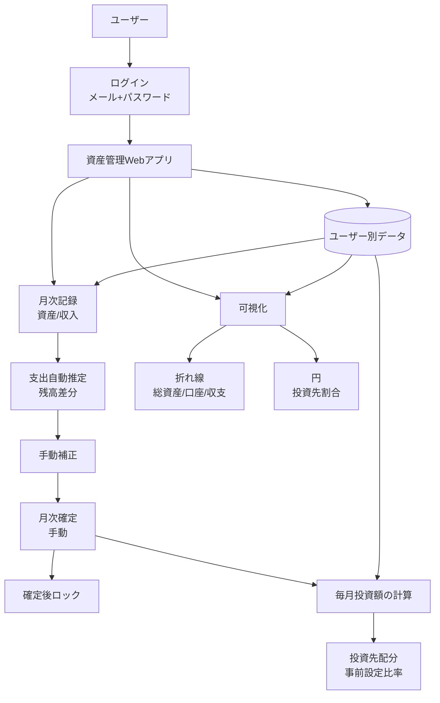

# システム概要

## 1. プロジェクト背景
現状の資産状況を継続的に把握しづらいという課題を解決するため、資産管理用のWebアプリケーションを構築する。
将来のライフプランに応じた出費と収入を月次で管理し、将来見通しに基づいて毎月の投資判断を行える状態を目指す。

## 2. システムの目的
「長期・積立・分散」の三原則を守りながら、毎月の投資可能額と投資先配分を算出し、将来資産の最大化を支援する。

## 3. ターゲットユーザー
| ユーザー種別 | 説明 | 主な利用シーン |
|---|---|---|
| ユーザー | メール+パスワードでログインし、自身のデータで利用する。複数端末からの同時ログインを許可する。 | 月次の資産・収入・支出記録、投資計算、推移確認 |

## 4. システム構成
本システムはWebアプリケーションとして提供し、PCブラウザとスマホの両方で利用できるUIを提供する。
ユーザー認証（メール+パスワード）を行い、ユーザーごとにデータを分離管理する。
月次運用は「記録→推定→補正→手動確定→確定後ロック」を基本とする。
未確定月は遡って入力可能とし、確定済み月は編集不可とする。
銀行/QR/カード/証券などの外部サービス連携は v1 では行わず、手入力のみで運用する。

## 5. 主要機能一覧
| # | 機能名 | 概要 | 優先度 |
|---|---|---|---|
| 1 | 認証・ユーザー管理 | メール+パスワードでログインし、ユーザーごとにデータを分離管理する。 | Must |
| 2 | 月次データ登録 | 毎月1回、資産・収入を登録する。資産カテゴリはユーザー定義とし、銀行/QR決済/クレジットカード引落予定/株を含めて運用可能にする。 | Must |
| 2.1 | 資産内訳管理 | 資産データは口座/銘柄単位で管理する。 | Must |
| 3 | 支出自動推定と補正 | 残高差分から支出を自動推定し、月次確定前に手動補正できるようにする。 | Must |
| 4 | 月次確定とロック | ユーザーが手動で月次確定を行い、確定後の当該月データは編集不可にする。 | Must |
| 5 | 総資産の月次集計 | 登録データから総資産を毎月算出する。クレジットカード引落予定額は負債として控除する。 | Must |
| 6 | ライフプラン登録 | 将来支出を単発イベント（年月・金額・メモ）で登録する。 | Must |
| 7 | 毎月投資額の計算と配分 | 1. 累積収入・支出の計算: 将来の大きな出費があるライフプランそれぞれまでの各月の累積収入と累積支出を算出 2. 余力資産の算出: 余力資産 = 累積収入 - 累積支出 - 生活防衛資金（任意にバッファーとして余分に金額を低く見積もるための項） 3. 投資可能額の計算: 投資可能額 = 余力資産 ÷ 現在月からその月までの月数 4. 最適戦略の決定: 求めた投資可能額を元々決めていた投資先の割合になるようにリバランスするように投資額を分配する。投資可能額が0未満の場合は0円として扱う。投資先や投資比率はユーザー自由登録とし、配分比率は合計100%必須とする。 | Must |
| 7.1 | 配分端数処理 | 配分金額は1円単位で算出し、端数は最大比率の投資先へ配分する。 | Must |
| 7.2 | 計算結果表示 | 投資可能額、投資先ごとの配分額、計算根拠値（累積収入・累積支出・余力資産）を表示する。 | Must |
| 7.3 | 計算実行タイミング | 毎月投資計算は月次確定時に自動実行する。 | Must |
| 8 | 可視化 | 総資産推移・口座推移・収支推移などの任意の資産を折れ線グラフで可視化し、投資先割合を円グラフで可視化する。 | Must |
| 9 | 月次リマインド通知 | 月次入力を促す通知機能。v1では実装対象外とする。 | Won't (v1) |

## 6. 技術スタック
| レイヤー | 技術 | バージョン | 備考 |
|---|---|---|---|
| 方針 | 通貨 | - | 日本円（JPY）のみ対応 |
| 方針 | 認証方式 | - | メール+パスワード |
| 方針 | 価格変動資産の評価時点 | - | 月末時点で評価する |
| 方針 | パスワード再設定 | - | メールで再設定可能 |

## 7. 制約事項・前提条件
- 個人利用を中心とする。
- ユーザーごとにログインし、データを分離管理する。
- 複数端末からの同時ログインを許可する。
- 月次（毎月1回）の記録運用を前提とする。
- 月次確定期限は翌月末までとする。
- 月次確定は手動操作で行い、確定後は編集不可とする。
- 設定変更時の再計算は未確定月のみを対象とする。
- 変更履歴は保持しない。
- 退会は論理削除で扱う。
- 金額は日本円（JPY）の単一通貨で扱う。
- 外部サービス連携は v1 では行わず、手入力のみで運用する。
- バックアップ機能は v1 未対応とする。
- PCとスマホの両方で利用できるUIを前提とする。
- 月次リマインド通知はv1対象外とする。

## 8. 成功指標（KPI）
| 指標 | 定義 | 目標値 |
|---|---|---|
| 月次記録完了率 | 各月で資産・収入・支出記録を完了した割合 | 100%（直近12か月） |
| 月次投資計算実行率 | 各月で投資計算を実行した割合 | 100%（直近12か月） |
