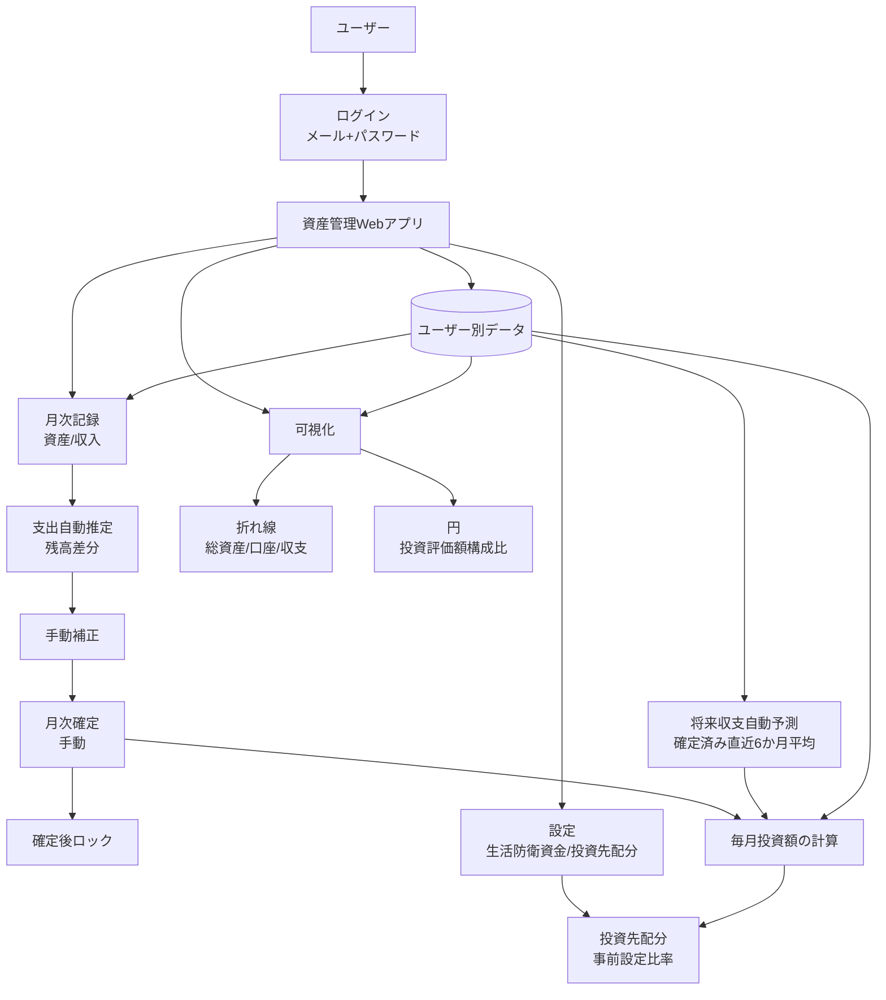

# システム概要

## 1. プロジェクト背景
現状の資産状況を継続的に把握しづらいという課題を解決するため、資産管理用のWebアプリケーションを構築する。
将来のライフプランに応じた出費と収入を月次で管理し、将来見通しに基づいて毎月の投資判断を行える状態を目指す。

## 2. システムの目的
「長期・積立・分散」の三原則を守りながら、毎月の投資可能額と投資先配分を算出し、将来資産の最大化を支援する。

## 3. ターゲットユーザー
| ユーザー種別 | 説明 | 主な利用シーン |
|---|---|---|
| ユーザー | メール+パスワードでログインし、自身のデータで利用する。複数端末からの同時ログインを許可する。 | 月次の資産・収入・支出記録、投資計算、推移確認 |

## 4. システム構成
本システムはWebアプリケーションとして提供し、PCブラウザとスマホの両方で利用できるUIを提供する。
ユーザー認証（メール+パスワード）を行い、ユーザーごとにデータを分離管理する。
月次運用は「記録→推定→補正→手動確定→確定後ロック」を基本とする。
未確定月は遡って入力可能とし、確定済み月は編集不可とする。
月次記録では資産・収入・投資評価額を入力し、投資先の追加・編集・削除や比率設定は設定画面で管理する。
ダッシュボードに表示する数値とサマリーは、常に最新の確定済み月を基準にする。
ダッシュボードでは、通常資産一覧を総資産の内訳の一部として表示し、投資は投資構成カードで別に扱う。総資産そのものは通常資産合計と投資評価額合計の合計として扱う。
投資計算に使う将来収支は、確定済み月の実績から直近6か月平均で自動予測する。収入予測には賞与や臨時収入も含め、将来の大きな支出はライフプランイベントとして通常支出と別に累積支出へ加算する。
資産は名称単位でライフサイクル管理し、追加した月から毎月の入力項目として自動表示する。
翌月以降に自動表示される資産の評価額は空欄を初期値とする。
削除した資産は最新の確定月までは保持し、次の未確定月から入力項目に表示しない。
削除済み資産は復活可能とし、復活時は最新の確定月の次の未確定月から再表示する（削除期間は非表示のまま保持）。
銀行/QR/カード/証券などの外部サービス連携は v1 では行わず、手入力のみで運用する。

## 5. 主要機能一覧
| # | 機能名 | 概要 | 優先度 |
|---|---|---|---|
| 1 | 認証・ユーザー管理 | メール+パスワードでログインし、ユーザーごとにデータを分離管理する。 | Must |
| 2 | 月次データ登録 | 毎月1回、資産・収入・投資評価額を登録する。資産は名称単位、収入は明細単位で管理する。 | Must |
| 2.1 | 資産管理 | 資産は名称単位で管理し、追加・削除・復活を含むライフサイクルに従って毎月の入力対象として継続表示する。 | Must |
| 2.2 | 投資入力管理 | 月次記録では、設定画面で定義済みの投資先に対するその月の評価額のみを入力する。投資資産は通常資産とは別管理とする。 | Must |
| 3 | 支出自動推定と補正 | 残高差分から支出を自動推定し、月次確定前に手動補正できるようにする。 | Must |
| 4 | 月次確定とロック | ユーザーが手動で月次確定を行い、確定後の当該月データは編集不可にする。 | Must |
| 5 | 総資産の月次集計 | 登録データから総資産を毎月算出する。総資産は通常資産と投資評価額の合計で算出し、クレジットカード引落予定額は負債として控除する。 | Must |
| 6 | ライフプラン登録 | 将来支出を単発イベント（年月・金額・メモ）で登録する。 | Must |
| 6.1 | 設定管理 | 生活防衛資金と投資先配分を設定し、投資先の追加・編集・削除を一覧一括編集で行う。 | Must |
| 6.2 | 将来収支自動予測 | 確定済み月の直近6か月実績から、投資計算に使う予測月次収入と予測月次支出を自動算出する。確定済み月が6か月未満の場合は存在する月のみで平均し、収入には賞与や臨時収入も含める。 | Must |
| 7 | 毎月投資額の計算と配分 | 1. 累積収入・支出の計算: 確定済み月の直近6か月平均から算出した予測月次収入・予測月次支出をもとに、各ライフプランイベントまでの累積収入と累積支出を算出する。ライフプランイベントの金額は累積支出へ別加算する 2. 余力資産の算出: 余力資産 = 累積収入 - 累積支出 - 生活防衛資金（任意にバッファーとして余分に金額を低く見積もるための項） 3. 投資可能額の計算: 各ライフプランイベントについて投資可能額 = 余力資産 ÷ 現在月からその月までの月数を算出し、その中で最も金額が低いものを採用する 4. 最適戦略の決定: 採用した投資可能額を元々決めていた投資先の割合になるようにリバランスするように投資額を分配する。投資可能額が0未満の場合は0円として扱う。投資先や投資比率はユーザー自由登録とし、配分比率は合計100%必須とする。 | Must |
| 7.1 | 配分端数処理 | 配分金額は1円単位で算出し、端数は最大比率の投資先へ配分する。 | Must |
| 7.2 | 計算結果表示 | 投資可能額、予測月次収入、予測月次支出、投資先ごとの配分額、採用されたライフプランイベント、計算根拠値（累積収入・累積支出・余力資産）を表示する。ダッシュボードでは各投資先の実績構成比、理想比率との差分、最新確定月の評価額も表示する。 | Must |
| 7.3 | 計算実行タイミング | 毎月投資計算は月次確定時に自動実行する。 | Must |
| 8 | 可視化 | 総資産推移・口座推移・収支推移などの任意の資産を折れ線グラフで可視化し、最新確定月の投資評価額構成比を円グラフで可視化する。 | Must |
| 9 | 月次リマインド通知 | 月次入力を促す通知機能。v1では実装対象外とする。 | Won't (v1) |

## 6. 技術スタック
| レイヤー | 技術 | バージョン | 備考 |
|---|---|---|---|
| 方針 | 通貨 | - | 日本円（JPY）のみ対応 |
| 方針 | 認証方式 | - | メール+パスワード |
| 方針 | 価格変動資産の評価時点 | - | 月末時点で評価する |
| 方針 | パスワード再設定 | - | メールで再設定可能 |

## 7. 制約事項・前提条件
- 個人利用を中心とする。
- ユーザーごとにログインし、データを分離管理する。
- 複数端末からの同時ログインを許可する。
- 月次（毎月1回）の記録運用を前提とする。
- 月次確定期限は翌月末までとする。
- 月次確定は手動操作で行い、確定後は編集不可とする。
- 資産はカテゴリ分けせず名称単位で管理する。
- 資産ライフサイクル（追加/削除/復活）は名称単位の資産に適用する。
- 追加した資産は追加月から入力項目へ継続表示し、翌月以降の評価額初期値は空欄とする。
- 削除した資産は最新の確定月まで保持し、その次の未確定月から入力項目で非表示にする。
- 復活した資産は最新の確定月の次の未確定月から再表示し、削除期間の月は非表示のままとする。
- 月次記録では投資先の追加・編集・削除は行わず、設定画面で定義された投資先に対するその月の評価額のみを入力する。
- ダッシュボードの表示は最新の確定済み月を基準とし、未確定月の値はサマリーや投資情報に使わない。
- 収入明細名は翌月以降も再利用できる前提とする。
- 将来収支予測は、確定済み月の直近6か月平均で自動算出し、手動入力や手動補正は行わない。
- 確定済み月が6か月未満の場合は、存在する確定済み月のみを平均対象とする。
- 収入予測には賞与や臨時収入も含める。
- 通常支出予測は確定済み月の支出実績から算出し、将来の大きな支出はライフプランイベントで別管理する。
- 設定変更時の再計算は未確定月のみを対象とする。
- 変更履歴は保持しない。
- 退会は論理削除で扱う。
- 金額は日本円（JPY）の単一通貨で扱う。
- 外部サービス連携は v1 では行わず、手入力のみで運用する。
- バックアップ機能は v1 未対応とする。
- PCとスマホの両方で利用できるUIを前提とする。
- 月次リマインド通知はv1対象外とする。

## 8. 成功指標（KPI）
| 指標 | 定義 | 目標値 |
|---|---|---|
| 月次記録完了率 | 各月で資産・収入・支出記録を完了した割合 | 100%（直近12か月） |
| 月次投資計算実行率 | 各月で投資計算を実行した割合 | 100%（直近12か月） |
