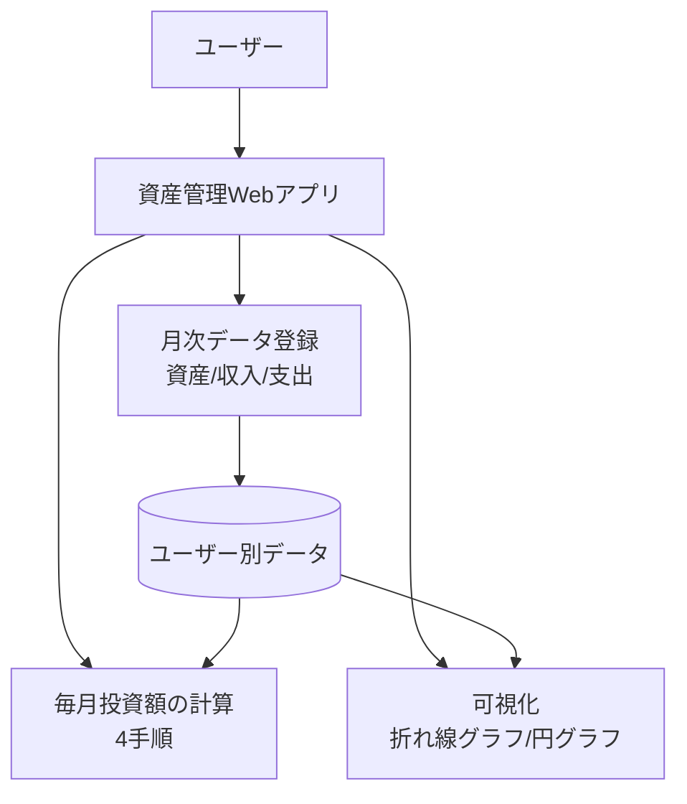

# システム概要

## 1. プロジェクト背景
現状の資産状況を継続的に把握しづらいという課題を解決するため、資産管理用のWebアプリケーションを構築する。
加えて、将来のライフプランに応じた出費と収入を見通しに反映し、毎月の投資判断を一貫した方針で行える状態を目指す。

## 2. システムの目的
「長期・積立・分散」の三原則を守りながら、毎月の投資可能額と投資先配分を算出し、将来資産の最大化を支援する。

## 3. ターゲットユーザー
| ユーザー種別 | 説明 | 主な利用シーン |
|---|---|---|
| ユーザー | ユーザーごとにログインし、自身のデータで利用する。 | 毎月の資産・収入・支出の登録、投資額計算、推移確認 |

## 4. システム構成
本システムはWebアプリケーションとして提供し、PCブラウザとスマホの両方で利用できるUIを提供する。

## 5. 主要機能一覧
| # | 機能名 | 概要 | 優先度 |
|---|---|---|---|
| 1 | 月次資産登録 | 毎月1回、銀行口座残高、QRコード決済アプリ残高、クレジットカードの引き落とし予定額、株などを登録する。 | |
| 2 | 月次収入・支出記録 | 毎月の収入を記録し、支出を計算して記録する。 | |
| 3 | 総資産の月次集計 | 登録データをもとに総資産を毎月算出する。 | |
| 4 | 毎月投資額の計算 | 1. 累積収入・支出の計算: 将来の大きな出費があるライフプランそれぞれまでの各月の累積収入と累積支出を算出 2. 余力資産の算出: 余力資産 = 累積収入 - 累積支出 - 生活防衛資金（任意にバッファーとして余分に金額を低く見積もるための項） 3. 投資可能額の計算: 投資可能額 = 余力資産 ÷ 現在月からその月までの月数 4. 最適戦略の決定: 求めた投資可能額を元々決めていた投資先の割合になるようにリバランスするように投資額を分配する。 | |
| 5 | 可視化 | 総資産推移・口座推移など任意資産を折れ線グラフで可視化し、投資先割合を円グラフで可視化する。 | |

## 6. 技術スタック
| レイヤー | 技術 | バージョン | 備考 |
|---|---|---|---|

## 7. 制約事項・前提条件
- 個人利用を中心とする。
- ユーザーごとにログインし、データを分離管理する。
- 月次（毎月1回）の記録運用を前提とする。
- PCとスマホの両方で利用できるUIを前提とする。

## 8. 成功指標（KPI）
