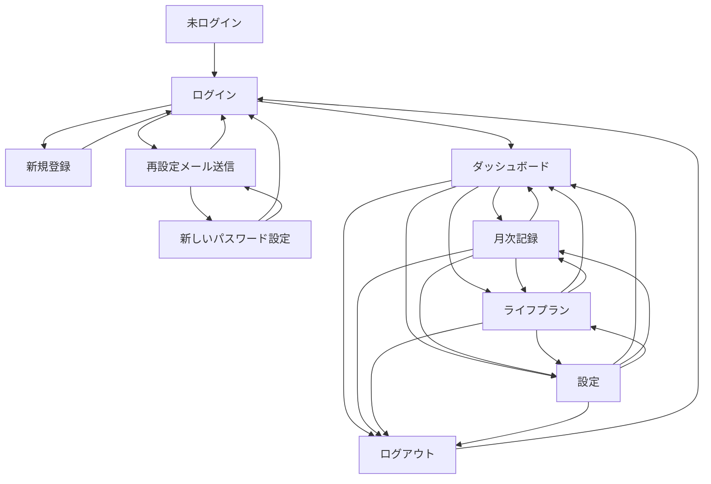

# 画面設計書

本書は、資産管理アプリの画面構成、表示要素、主要操作、レスポンシブ方針を定義する。  
内容は `OVERVIEW.md`、`REQUIREMENTS.md`、`SCREEN_DESIGN_DRAFT.md`、および現行 mockup 実装をもとに整理している。  
なお、認証補助画面のURLは、画面設計書上の仮固定値として `/signup`、`/password-reset/request`、`/password-reset/reset` を採用している。

## 1. 画面一覧
| # | 画面ID | 画面名 | URL | 認証 | ロール | 説明 |
|---|---|---|---|---|---|---|
| 1 | SCR-AUTH-01 | ログイン | `/login` | 不要 | ユーザー | メールアドレスとパスワードでログインする。 |
| 2 | SCR-AUTH-02 | 新規登録 | `/signup` | 不要 | ユーザー | メールアドレスとパスワードで自己登録する。 |
| 3 | SCR-AUTH-03 | 再設定メール送信 | `/password-reset/request` | 不要 | ユーザー | パスワード再設定用メールの送信を開始する。 |
| 4 | SCR-AUTH-04 | 新しいパスワード設定 | `/password-reset/reset` | 不要 | ユーザー | メールリンクから新しいパスワードを設定する。 |
| 5 | SCR-APP-01 | ダッシュボード | `/dashboard` | 必要 | ユーザー | 最新確定月を基準に、資産状況、投資判断、投資構成、推移を確認する。 |
| 6 | SCR-APP-02 | 月次記録 | `/monthly-record` | 必要 | ユーザー | 月ごとの資産、収入、投資評価額を入力し、支出確認後に確定する。 |
| 7 | SCR-APP-03 | ライフプラン | `/life-plan` | 必要 | ユーザー | 将来イベントを年月、内容、金額、メモ単位で管理する。 |
| 8 | SCR-APP-04 | 設定 | `/settings` | 必要 | ユーザー | 生活防衛資金、投資先配分、将来収支予測前提を確認・管理する。 |

## 2. 画面遷移図

## 3. 画面詳細
### 3.1 ログイン
#### 概要
- メールアドレスとパスワードによるログインを行う画面。
- 新規登録画面、パスワード再設定画面への導線を持つ。
- セッション失効時や認証失敗時の再入力起点とする。

#### ワイヤーフレーム
- 画面中央に認証カードを配置する1カラム構成。
- 認証カード内にメールアドレス入力欄、パスワード入力欄、ログインボタンを縦積みで配置する。
- カード下部に `新規登録` と `パスワード再設定` のテキスト導線を配置する。
- 認証失敗またはセッション失効時は、カード上部のバナー領域に理由を表示する。

#### 表示項目
| # | 項目名 | 型 | 必須 | 説明 |
|---|---|---|---|---|
| 1 | メールアドレス | テキスト入力 | ○ | ログイン対象のメールアドレスを入力する。 |
| 2 | パスワード | パスワード入力 | ○ | ログイン対象のパスワードを入力する。 |
| 3 | ログインボタン | ボタン | - | 認証を実行する。 |
| 4 | 新規登録導線 | テキストリンク | - | 新規登録画面へ遷移する。 |
| 5 | パスワード再設定導線 | テキストリンク | - | パスワード再設定画面へ遷移する。 |
| 6 | エラーメッセージ領域 | バナー | - | ログイン失敗理由やセッション失効理由を表示する。 |

#### アクション
| # | アクション | トリガー | 処理内容 | API |
|---|---|---|---|---|
| 1 | ログイン | ログインボタン押下 | 入力値で認証を行い、成功時はダッシュボードへ遷移する。 | API仕様書で定義 |
| 2 | 新規登録へ遷移 | 新規登録導線押下 | 新規登録画面へ遷移する。 | - |
| 3 | パスワード再設定へ遷移 | パスワード再設定導線押下 | パスワード再設定画面へ遷移する。 | - |

#### バリデーション
- メールアドレスは空欄不可とする。
- パスワードは空欄不可とする。

#### エラー表示
- 認証失敗時は、ログイン失敗の理由を画面上部バナーに表示する。
- セッション失効時は、再ログインが必要な理由を画面上部バナーに表示する。

#### レスポンシブ対応
- PC、スマホともに中央寄せの認証カード構成とする。
- スマホではカード幅を画面幅に追従させ、縦スクロールで完結する。

### 3.2 新規登録
#### 概要
- ユーザーがメールアドレスとパスワードで自己登録する画面。
- 登録後はログイン画面へ遷移できる状態にする。
- 入力項目はメールアドレスとパスワードのみとする。

#### ワイヤーフレーム
- ログイン画面と同系統の中央カードレイアウトとする。
- カード内にメールアドレス、パスワード、登録ボタンを縦積みで配置する。
- カード下部にログイン画面への戻り導線を配置する。
- エラーや登録完了は、カード上部のバナー領域に表示する。

#### 表示項目
| # | 項目名 | 型 | 必須 | 説明 |
|---|---|---|---|---|
| 1 | メールアドレス | テキスト入力 | ○ | 登録するメールアドレスを入力する。 |
| 2 | パスワード | パスワード入力 | ○ | 登録するパスワードを入力する。 |
| 3 | 登録ボタン | ボタン | - | 登録処理を実行する。 |
| 4 | ログイン導線 | テキストリンク | - | ログイン画面へ戻る。 |
| 5 | 結果メッセージ領域 | バナー | - | 入力不備、登録失敗、登録完了を表示する。 |

#### アクション
| # | アクション | トリガー | 処理内容 | API |
|---|---|---|---|---|
| 1 | 新規登録 | 登録ボタン押下 | 入力値でユーザー登録を行い、完了後はログイン画面へ戻す。 | API仕様書で定義 |
| 2 | ログインへ戻る | ログイン導線押下 | ログイン画面へ遷移する。 | - |

#### バリデーション
- メールアドレスは空欄不可、メール形式であること。
- パスワードは8文字以上かつ英字と数字を含むこと。

#### エラー表示
- 既存メールアドレスで登録しようとした場合は理由を画面上部バナーに表示する。
- パスワード強度不足や形式不備は画面上部バナーを中心に表示する。
- 登録完了時は完了バナーを表示し、ログイン画面へ戻る導線を示す。

#### レスポンシブ対応
- ログイン画面と同様に、中央カード型の単一画面とする。
- スマホでは入力欄とボタンを縦方向に詰めて表示する。

### 3.3 再設定メール送信
#### 概要
- メール経由でパスワード再設定フローを開始する画面。
- 登録済みメールアドレスに対して再設定用メールの送信を行う。

#### ワイヤーフレーム
- 中央カードレイアウトとする。
- メールアドレス入力欄と送信ボタンを表示する。
- 画面下部にログイン画面への戻り導線を配置する。
- 送信結果やエラーは、カード上部のバナー領域に表示する。

#### 表示項目
| # | 項目名 | 型 | 必須 | 説明 |
|---|---|---|---|---|
| 1 | メールアドレス | テキスト入力 | ○ | 再設定対象のメールアドレスを入力する。 |
| 2 | 送信ボタン | ボタン | - | 再設定フローを開始する。 |
| 3 | ログイン導線 | テキストリンク | - | ログイン画面へ戻る。 |
| 4 | 結果メッセージ領域 | バナー | - | 送信結果や失敗理由を表示する。 |

#### アクション
| # | アクション | トリガー | 処理内容 | API |
|---|---|---|---|---|
| 1 | 再設定開始 | 送信ボタン押下 | メール経由の再設定フローを開始する。 | API仕様書で定義 |
| 2 | ログインへ戻る | ログイン導線押下 | ログイン画面へ遷移する。 | - |

#### バリデーション
- メールアドレスは空欄不可、メール形式であること。

#### エラー表示
- 未登録メールアドレスや送信失敗は、画面上部バナーに表示する。
- 送信完了時は完了バナーを表示する。

#### レスポンシブ対応
- ログイン画面と同様に、中央カード型の単一画面とする。
- スマホでもメール送信画面単体で完結する構成とする。

### 3.4 新しいパスワード設定
#### 概要
- 再設定メール内のリンクから遷移し、新しいパスワードを設定する画面。
- 完了後は完了表示を行い、ログイン画面へ戻す。
- リンク不正または期限切れ時は、再設定メール送信画面へ戻す導線を出す。

#### ワイヤーフレーム
- 中央カードレイアウトとする。
- カード内に新しいパスワード、確認用パスワード、再設定ボタンを縦積みで配置する。
- カード上部に結果バナーを表示できる領域を持つ。
- カード下部にログイン画面への戻り導線と、再設定メール送信画面への戻り導線を配置する。

#### 表示項目
| # | 項目名 | 型 | 必須 | 説明 |
|---|---|---|---|---|
| 1 | 新しいパスワード | パスワード入力 | ○ | 新しいパスワードを入力する。 |
| 2 | 確認用パスワード | パスワード入力 | ○ | 新しいパスワードの一致確認に使う。 |
| 3 | 再設定ボタン | ボタン | - | パスワード再設定を完了する。 |
| 4 | ログイン導線 | テキストリンク | - | ログイン画面へ戻る。 |
| 5 | 再設定メール送信へ戻る導線 | テキストリンク | - | 再設定メール送信画面へ戻る。 |
| 6 | 結果メッセージ領域 | バナー | - | 再設定完了、リンク不正、期限切れ、失敗理由を表示する。 |

#### アクション
| # | アクション | トリガー | 処理内容 | API |
|---|---|---|---|---|
| 1 | パスワード再設定 | 再設定ボタン押下 | 新しいパスワードを保存し、完了後はログイン画面へ戻す。 | API仕様書で定義 |
| 2 | ログインへ戻る | ログイン導線押下 | ログイン画面へ遷移する。 | - |
| 3 | 再設定メール送信へ戻る | 再送導線押下 | 再設定メール送信画面へ遷移する。 | - |

#### バリデーション
- 新しいパスワードは8文字以上かつ英字と数字を含むこと。
- 確認用パスワードは新しいパスワードと一致すること。

#### エラー表示
- リンク不正または期限切れ時は、画面上部バナーで理由を表示する。
- 再設定完了時は完了バナーを表示し、ログイン画面へ戻れるようにする。

#### レスポンシブ対応
- ログイン画面と同様に、中央カード型の単一画面とする。
- スマホでも再設定画面単体で完結する構成とする。

### 3.5 ダッシュボード
#### 概要
- ログイン後の起点画面。
- 最新の確定済み月を基準に、資産状況、投資可能額、投資構成、推移グラフを確認する。
- PCでは `資産サマリーカード` と `投資構成カード` を横並び、その下に `将来収支と投資判断カード`、さらに下に `資産グラフカード` を配置する。

#### ワイヤーフレーム
- 画面左に共通サイドメニュー、右にメインコンテンツを配置する。
- メイン先頭にタイトルカード、その下にKPIカード4枚を横並びで配置する。
- その下に `資産サマリーカード` と `投資構成カード` を2カラムで配置する。
- 次段に `将来収支と投資判断カード` をフル幅で配置する。
- 最下段に `資産グラフカード` を配置する。
- モバイルでは各カードを縦積みとする。

#### 表示項目
| # | 項目名 | 型 | 必須 | 説明 |
|---|---|---|---|---|
| 1 | 分析対象月表示 | ステータス表示 | - | 最新の確定済み月を表示する。 |
| 2 | 総資産 | KPIカード | - | 最新確定月の総資産を表示する。 |
| 3 | 月次収入 | KPIカード | - | 最新確定月の収入合計を表示する。 |
| 4 | 推定/補正後支出 | KPIカード | - | 最新確定月の確定支出を表示する。 |
| 5 | 投資可能額 | KPIカード | - | 全ライフイベント比較で最小となる投資可能額を表示する。 |
| 6 | 資産サマリーカード | 情報カード | - | 総資産、収入、支出、投資評価額合計、生活防衛資金、通常資産上位3件を表示する。上位3件には負債も絶対値で含める。 |
| 7 | 通常資産全件モーダル導線 | ボタン | - | 通常資産全件を一覧だけのモーダルで開く。 |
| 8 | 投資構成カード | 情報カード | - | 最新確定月の投資評価額構成比円グラフ、実績比率、理想比率、差分、評価額を表示する。差分は数値と色付きバッジで示す。 |
| 9 | 将来収支と投資判断カード | 情報カード | - | 予測月次収入、予測月次支出、平均対象月数、投資可能額、累積収入、累積支出、余力資産、採用イベントを表示する。 |
| 10 | 資産グラフカード | グラフカード | - | 単一対象の資産推移グラフを表示する。収入と支出も正の値として表示できる。 |
| 11 | 表示対象選択 | セレクト | - | `総資産 → 収入 → 支出 → 個別項目` の順で選択する。個別項目には通常資産と投資先を含む。 |
| 12 | 表示期間切替 | ボタン群 | - | `3か月 / 6か月 / 1年 / 全期間` を切り替える。 |

#### アクション
| # | アクション | トリガー | 処理内容 | API |
|---|---|---|---|---|
| 1 | 画面遷移 | サイドメニュー押下 | 各機能画面へ遷移する。 | - |
| 2 | ログアウト | ユーザーメニュー押下 | ログアウトしてログイン画面へ戻る。 | API仕様書で定義 |
| 3 | 通常資産全件表示 | `すべて見る` 押下 | 通常資産全件モーダルを開く。 | - |
| 4 | グラフ対象切替 | 表示対象選択変更 | 折れ線グラフの対象系列を切り替える。 | - |
| 5 | 表示期間切替 | 期間ボタン押下 | 折れ線グラフの期間を切り替える。 | - |

#### バリデーション
- ダッシュボードの数値サマリーと投資情報は、確定済み月が存在する場合のみ表示する。
- 円グラフと投資構成一覧は、最新確定月の投資評価額が入力されている場合のみ表示する。
- 折れ線グラフは確定済み月のみを対象とする。

#### エラー表示
- 確定済み月が存在しない場合は、ダッシュボードの主要カードを説明のみの空状態表示に切り替える。
- 投資評価額が未入力の場合は、投資構成カードを空状態表示に切り替える。
- 将来収支予測や投資判断が算出不可の場合は、理由のみを表示する。

#### レスポンシブ対応
- PCでは左サイドメニューを表示する。サイドメニューは幅可変、折りたたみ可能とする。
- モバイルでは左サイドメニューの代わりに、上部 sticky ヘッダーを表示する。
- モバイルヘッダーには `ダッシュボード / 月次記録 / ライフプラン / 設定` のアイコン導線と、右端にユーザーアイコンを配置する。
- `lg` 以上では `資産サマリーカード` と `投資構成カード` を横並びにし、それ未満では縦積みとする。

### 3.6 月次記録
#### 概要
- 月ごとの資産、収入、投資評価額を入力し、支出確認後に月次確定を行う画面。
- 画面上部に表示対象月、メイン領域に `資産入力カード / 収入入力カード / 投資入力カード` を配置する。
- 画面下部には sticky アクションバーとして `月次確定` を表示する。
- 入力は変更のたびに即保存し、月次確定は月をロックする操作として扱う。

#### ワイヤーフレーム
- タイトルカードの下に、対象月切替カードを配置する。
- 対象月切替カード内に `前月 / 年月表示 / 翌月` と、対象月の `確定済み / 未確定` ステータスを表示する。
- 確定済み月では対象月カード内に確定支出も表示する。
- その下に `資産入力カード` と右側の `収入入力カード + 投資入力カード` を配置する2カラム構成とする。
- 未確定月では各カードを入力レイアウト、確定済み月では `名称 + 金額` を見る閲覧専用レイアウトに切り替える。
- モバイルでは3カードを縦積みとする。
- 画面最下部に sticky の月次確定バーを配置し、未入力時は警告文を表示する。確定済み月では閲覧専用バーに切り替える。

#### 表示項目
| # | 項目名 | 型 | 必須 | 説明 |
|---|---|---|---|---|
| 1 | 表示対象月 | テキスト | - | 現在表示中の年月を示す。確定済み月では支出確定値もあわせて表示する。 |
| 2 | 月移動ボタン | ボタン | - | 前月・翌月へ移動する。 |
| 3 | 月次ステータス | ステータス表示 | - | 対象月が `確定済み / 未確定` のどちらかを示す。 |
| 4 | 資産入力カード | 一覧入力 | - | 通常資産の名称、金額、編集導線を表示する。確定済み月では名称と金額だけの閲覧表示に切り替える。 |
| 5 | 削除済み資産復活導線 | ボタン群 | - | 削除済み資産を復活する。 |
| 6 | 収入入力カード | 一覧入力 | - | 収入明細名、金額、編集導線を表示する。確定済み月では名称と金額だけの閲覧表示に切り替える。 |
| 7 | 投資入力カード | 一覧入力 | - | 設定済み投資先ごとの評価額入力欄を表示する。投資先未設定時は説明のみの空状態を表示する。 |
| 8 | 資産追加モーダル | モーダル | - | 資産名を追加する。 |
| 9 | 資産編集モーダル | モーダル | - | 資産名、金額の編集や削除を行う。 |
| 10 | 収入追加モーダル | モーダル | - | 収入名を追加する。 |
| 11 | 収入編集モーダル | モーダル | - | 収入名、金額の編集や削除を行う。 |
| 12 | 月次確定確認モーダル | モーダル | - | 支出自動推定値、補正入力欄、推定不可理由、警告表示を持つ。 |
| 13 | 月次確定バー | 固定アクションバー | - | 未確定月では確定実行導線と注意文、確定済み月では閲覧専用メッセージを表示する。 |
| 14 | 期限超過警告 | バナー | - | 翌月末を超えた未確定月で警告表示する。 |

#### アクション
| # | アクション | トリガー | 処理内容 | API |
|---|---|---|---|---|
| 1 | 月切替 | 前月/翌月ボタン押下 | 表示対象月を切り替える。 | - |
| 2 | 資産追加 | `追加` 押下 | 資産追加モーダルを開き、資産名を登録する。 | API仕様書で定義 |
| 3 | 資産金額更新 | 入力欄変更 | 資産金額を即保存する。 | API仕様書で定義 |
| 4 | 資産編集 | 編集アイコン押下 | 未確定月に限り、資産編集モーダルを開く。未保存で閉じる場合は確認ダイアログを出す。 | API仕様書で定義 |
| 5 | 資産削除 | 編集モーダル内削除押下 | 確認ダイアログを経て削除し、次の未確定月から非表示にする。 | API仕様書で定義 |
| 6 | 資産復活 | 復活ボタン押下 | 削除済み資産を最新確定月の次の未確定月から再表示する。 | API仕様書で定義 |
| 7 | 収入追加 | `追加` 押下 | 収入追加モーダルを開き、収入名を登録する。 | API仕様書で定義 |
| 8 | 収入金額更新 | 入力欄変更 | 収入金額を即保存する。 | API仕様書で定義 |
| 9 | 収入編集 | 編集アイコン押下 | 収入編集モーダルを開く。名称変更は選択月から将来へ反映し、未保存で閉じる場合は確認ダイアログを出す。 | API仕様書で定義 |
| 10 | 収入削除 | 編集モーダル内削除押下 | 確認ダイアログを経て削除し、選択月から将来へ非表示にする。 | API仕様書で定義 |
| 11 | 投資評価額入力 | 入力欄変更 | 設定済み投資先の当月評価額を即保存する。 | API仕様書で定義 |
| 12 | 月次確定開始 | 月次確定ボタン押下 | 支出確認モーダルを開く。 | - |
| 13 | 月次確定 | 確定ボタン押下 | 支出補正後の値で月次を確定し、以後編集不可にする。 | API仕様書で定義 |

#### バリデーション
- 月次確定は古い未確定月から順番にのみ可能とする。
- 月移動は管理中の月に対してのみ行える。
- 資産名と収入名は同じ一覧内で重複不可とする。
- 表示中の通常資産、収入、投資評価額のいずれかに空欄がある場合は確定不可とする。警告は `資産 / 収入 / 投資評価額` の区分名単位で表示する。
- `0` は有効入力とし、空欄のみ未入力扱いとする。
- 投資入力カードは評価額のみ入力対象とし、投資先の追加・編集・削除導線は表示しない。
- 投資先が未設定でも、他の入力が揃っていれば月次確定は可能とする。
- 資産または収入が0件の月は空状態を表示し、追加されるまで確定不可とする。
- 資産、収入、投資先の表示順は登録順を維持する。
- 確定済み月では入力欄と編集導線を無効化するのではなく、閲覧専用レイアウトへ切り替える。

#### エラー表示
- 空欄がある場合は、月次確定バーおよび確認モーダルに警告文を表示する。
- 初月などで支出自動推定が計算不可の月は、確認モーダル内に理由を表示する。
- 確定期限超過時は画面上部バナーに警告を表示する。

#### レスポンシブ対応
- モバイルでは上部 sticky ヘッダーを使用し、各入力カードを縦積みとする。
- 月次確定バーは PC、モバイルともに画面下部に固定表示する。
- 最下部の入力欄が固定バーに隠れないよう、コンテンツ末尾に余白を確保する。

### 3.7 ライフプラン
#### 概要
- 将来の支出イベントを一覧管理する画面。
- 追加、編集、削除はモーダルで行い、一覧は `年月 / 内容 / 金額 / メモ` を基本表示する。
- 画面下部に sticky の `ライフプランを追加` バーを表示する。

#### ワイヤーフレーム
- タイトルカードの下にイベント一覧カードを配置する。
- 一覧は PC では行形式、モバイルではカード寄りの縦積み表示とする。
- 画面下部に sticky アクションバーとして追加ボタンを常時表示する。

#### 表示項目
| # | 項目名 | 型 | 必須 | 説明 |
|---|---|---|---|---|
| 1 | イベント一覧 | 一覧 | - | 年月、内容、金額、メモを表示する。 |
| 2 | 編集アイコン | ボタン | - | 該当イベントの編集モーダルを開く。 |
| 3 | ライフプラン追加バー | 固定アクションバー | - | 新規イベント追加導線を表示する。 |
| 4 | 追加モーダル | モーダル | - | 年月、内容、金額、メモを入力する。 |
| 5 | 編集モーダル | モーダル | - | イベント内容を編集し、削除導線を持つ。 |
| 6 | 削除確認ダイアログ | ダイアログ | - | 削除確定前の確認を行う。 |

#### アクション
| # | アクション | トリガー | 処理内容 | API |
|---|---|---|---|---|
| 1 | イベント追加 | 追加バー押下 | 追加モーダルを開く。 | - |
| 2 | イベント保存 | 追加/編集モーダル保存押下 | イベントを新規登録または更新する。 | API仕様書で定義 |
| 3 | イベント編集 | 編集アイコン押下 | 編集モーダルを開く。 | - |
| 4 | イベント削除 | 編集モーダル内削除押下 | 確認ダイアログ後に削除する。 | API仕様書で定義 |

#### バリデーション
- 年月、内容、金額は必須とする。
- 同じ年月に複数イベントがあっても登録可能とする。

#### エラー表示
- 必須項目未入力時は保存不可とし、画面内で理由を表示する。
- 削除は確認ダイアログを経由して誤操作を防止する。

#### レスポンシブ対応
- モバイルでは上部 sticky ヘッダーを使用する。
- 一覧はモバイル時に1イベントごとの縦積みカード寄り表示とする。
- 追加アクションバーは PC、モバイルともに画面下部固定とする。

### 3.8 設定
#### 概要
- 投資計算に使う前提値と投資先配分を管理する画面。
- `生活防衛資金`、`投資先配分比率`、`将来収支予測` の3領域で構成する。
- 設定変更は次の未確定月から反映する。

#### ワイヤーフレーム
- タイトルカードの下に、PCでは `生活防衛資金` と `投資先配分比率` を2カラムで配置する。
- その下に `将来収支予測` カードをフル幅で配置する。
- モバイルでは各カードを縦積みとする。

#### 表示項目
| # | 項目名 | 型 | 必須 | 説明 |
|---|---|---|---|---|
| 1 | 適用開始月表示 | ステータス表示 | - | 設定が反映される次の未確定月を示す。 |
| 2 | 生活防衛資金カード | 情報カード | - | 現在の設定、防衛資金額入力欄、保存ボタンを表示する。 |
| 3 | 投資先配分比率カード | 情報カード | - | 現在の投資先一覧、比率、一覧編集導線を表示する。 |
| 4 | 将来収支予測カード | 情報カード | - | 予測月次収入、予測月次支出、計算対象月数、予測ルール説明を表示する。 |
| 5 | 投資先一覧編集モーダル | モーダル | - | 投資先名、比率、行追加、行削除、合計比率、残り比率、保存ボタンを持つ。 |

#### アクション
| # | アクション | トリガー | 処理内容 | API |
|---|---|---|---|---|
| 1 | 生活防衛資金保存 | 保存ボタン押下 | 生活防衛資金を保存する。 | API仕様書で定義 |
| 2 | 投資先一覧編集開始 | `一覧編集` 押下 | 一括編集モーダルを開く。 | - |
| 3 | 投資先追加 | モーダル内行追加押下 | 新しい投資先入力行を追加する。 | - |
| 4 | 投資先削除 | モーダル内削除押下 | 投資先行を削除する。 | - |
| 5 | 投資先配分保存 | モーダル内保存押下 | 投資先一覧と配分比率をまとめて保存する。 | API仕様書で定義 |

#### バリデーション
- 生活防衛資金は数値入力必須とする。
- 投資先配分は名称重複不可とする。
- 投資先配分の比率合計は `100.00%` 厳密一致を必須とする。
- 比率が `100.00%` でない場合は保存不可とする。

#### エラー表示
- 投資先名の重複や空欄、比率不正、合計不一致はモーダル内で明示する。
- 将来収支予測は確認用表示であり、算出不可時は理由のみを表示する。

#### レスポンシブ対応
- モバイルでは上部 sticky ヘッダーを使用し、各カードを縦積みとする。
- 一括編集モーダルはモバイルでもスクロール可能な全画面寄り表示で扱えるようにする。

## 4. 共通コンポーネント
| コンポーネント | 使用画面 | 説明 |
|---|---|---|
| PC用サイドメニュー | ダッシュボード、月次記録、ライフプラン、設定 | 左側に常設するナビゲーション。幅可変、折りたたみ可能。 |
| モバイル用上部 sticky ヘッダー | ダッシュボード、月次記録、ライフプラン、設定 | 画面上部に固定表示する。主要4画面のアイコン導線とユーザーメニューを持つ。 |
| ユーザーメニュー | 認証後全画面 | ユーザー情報とログアウト導線を表示する。 |
| タイトルカード | 認証後全画面 | 画面タイトル、説明、補助ステータスを表示する共通ヘッダー領域。 |
| KPIカード | ダッシュボード | 総資産、月次収入、支出、投資可能額などの主要指標を表示する。 |
| グラフカード | ダッシュボード | 円グラフ、折れ線グラフを内包する共通カード。 |
| ステータス Pill | ダッシュボード、月次記録、設定 | 分析対象月、月次状態、適用開始月などの状態を簡潔に示す。 |
| 編集アイコン付き入力行 | 月次記録、ライフプラン、設定 | 行単位の編集モーダル起点として使う。 |
| モーダル | ログイン、月次記録、ライフプラン、設定 | 追加、編集、確認、一覧全件表示などの補助UIとして使う。 |
| 削除確認ダイアログ | 月次記録、ライフプラン | 削除前に確認を行い、誤操作を防止する。 |
| 下部 sticky アクションバー | 月次記録、ライフプラン | 主要操作をスクロール中も見失わないように画面下部へ固定表示する。 |
| トースト | 認証後全画面 | 保存成功、追加、削除、警告などの通知を右上に一定時間表示し、自動で閉じる。 |
| Empty State | ダッシュボード、ライフプラン | 表示対象データがない場合の代替表示として使う。 |
